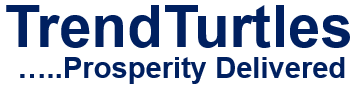

# Post Template

Copy-paste starting point for a new file at `blog/<slug>.html`. Rules, voice, pipeline and SEO checklist live in [`CONSTITUTION.md`](CONSTITUTION.md) — this file is just the mechanical skeleton, not a repeat of the rules.

Before filling this in, finish constitution §5 steps 1–3 (evergreen validation, gap analysis, keyword-mapped outline naming the 3-5 real-world reader segments for this topic). Then fill every `[BRACKETED]` placeholder below and delete anything not used (e.g. the FAQ block, or the chart figure, if this post doesn't need one).

This file is markdown, not `.html` — it will never be served as a live page, so it's safe to leave in the repo as a permanent reference.

**Before publishing, generate this post's share-card image** (fixes broken link previews on X/LinkedIn — every post needs an `og:image`, independent of whether it has a content image):
```
pwsh blog/generate-share-image.ps1 -Headline "[post <title> text]" -OutputPath "E:\Clone\Blog\trendturtles\assets\images\[SLUG]-share.png"
```
Use an absolute path for `-OutputPath` (a known PowerShell/.NET gotcha: relative paths resolve against the process's current directory, not necessarily where you expect, and fail with a GDI+ error).

```html
<!DOCTYPE html>
<html lang="en-IN">
<head>
    <meta charset="UTF-8">
    <meta name="viewport" content="width=device-width, initial-scale=1.0">
    <title>[TITLE — 50-60 chars, primary keyword near the front]</title>
    <meta name="description" content="[META DESCRIPTION — 150-160 chars, unique, states the specific fact/benefit]">
    <meta name="author" content="Mayank Gola">
    <meta name="robots" content="index, follow, max-snippet:-1, max-image-preview:large, max-video-preview:-1">
    <meta property="og:title" content="[OG TITLE — can match <title>]">
    <meta property="og:description" content="[OG DESCRIPTION — can match meta description]">
    <meta property="og:url" content="https://trendturtles.com/blog/[SLUG].html">
    <meta property="og:type" content="article">
    <meta property="og:site_name" content="TrendTurtles">
    <meta property="og:image" content="https://trendturtles.com/assets/images/[SLUG]-share.png">
    <meta property="og:image:width" content="1200">
    <meta property="og:image:height" content="630">
    <meta name="twitter:card" content="summary_large_image">
    <meta name="twitter:title" content="[OG TITLE]">
    <meta name="twitter:description" content="[OG DESCRIPTION]">
    <meta name="twitter:image" content="https://trendturtles.com/assets/images/[SLUG]-share.png">
    <link rel="canonical" href="https://trendturtles.com/blog/[SLUG].html">
    <link rel="icon" href="/favicon-512.png">
    <link rel="apple-touch-icon" href="/apple-touch-icon.png">
    <link rel="stylesheet" href="../style.css">
    <link rel="stylesheet" href="blog.css">
    <script type="application/ld+json">
    {
        "@context": "https://schema.org",
        "@type": "BlogPosting",
        "headline": "[HEADLINE — <=110 chars]",
        "description": "[SAME AS META DESCRIPTION]",
        "mainEntityOfPage": "https://trendturtles.com/blog/[SLUG].html",
        "datePublished": "[YYYY-MM-DD]",
        "dateModified": "[YYYY-MM-DD]",
        "inLanguage": "en-IN",
        "image": "https://trendturtles.com/assets/images/[SLUG]-share.png",
        "author": {
            "@type": "Person",
            "name": "Mayank Gola",
            "url": "https://trendturtles.com/about.html"
        },
        "publisher": {
            "@type": "Organization",
            "name": "TrendTurtles",
            "url": "https://trendturtles.com/",
            "logo": {
                "@type": "ImageObject",
                "url": "https://trendturtles.com/favicon-512.png",
                "width": 512,
                "height": 512
            }
        }
    }
    </script>
    <!-- Optional: add a second ld+json script, type BreadcrumbList, mirroring the
         visible breadcrumb below exactly (Home > Blog > [POST TITLE]) -->
    <!-- Optional: add a third ld+json script, type FAQPage, ONLY if the FAQ
         section below is kept and has genuine, non-manufactured Q&As -->
</head>
<body>

<header>
    <div class="logo">
        <a href="../index.html">
            
        </a>
    </div>
    <div class="menu-toggle" id="menu-toggle">☰</div>
    <nav id="nav-menu">
        <a href="../index.html">Home</a>
        <a href="../about.html">About</a>
        <a href="../products-services.html">Products & Services</a>
        <a href="index.html">Blog</a>
        <a href="../contact.html">Contact</a>
    </nav>
</header>

<section class="hero">
    <p class="breadcrumb">
        <a href="../index.html">Home</a> &rsaquo;
        <a href="index.html">Blog</a> &rsaquo;
        <span class="current">[POST TITLE, SHORT]</span>
    </p>
    <h1>[H1 — benefit/fact-led headline with a real number or concrete claim. Not blind. Model: "At 60 miles an hour the loudest noise in this new Rolls-Royce comes from the electric clock" — specificity over hype.]</h1>
</section>

<section class="section">

    <p class="byline">
        By <strong>Mayank Gola</strong>, TrendTurtles &nbsp;·&nbsp; [X] min read &nbsp;·&nbsp; Published: [Month YYYY]
    </p>

    <p>[LEAD PARAGRAPH — news-lead style. State the single most important, most interesting true fact in sentence one. No scene-setting, no throat-clearing.]</p>

    <h2>[H2 — first section, plain-language, maps to a keyword variant or the gap found in research]</h2>
    <p>[Body copy. Short sentences, short paragraphs. Every data claim hyperlinked to a named primary source — SEBI, RBI, NSE, AMFI — <code>target="_blank" rel="noopener noreferrer"</code>. No jargon without a same-sentence plain explanation. Write for the real-world reader segments named at the outline stage, not a generic "investor."]</p>

    <h2>[H2 — next section]</h2>
    <p>[...]</p>

    <!-- Optional pull-quote for a single striking fact or stat -->
    <!--
    <p class="pull-quote">[ONE STRIKING, VERIFIED FACT OR QUOTE]</p>
    -->

    <!-- REQUIRED: at least one comparison table that makes the point concrete —
         e.g. Option A vs B vs C, Shop 1 vs Shop 2, Before vs After.
         Prefer a plain HTML table over a chart image for simple numeric comparisons
         (lighter, more accessible, no image needed). -->
    <h2>[H2 — the comparison, e.g. "X vs Y vs Z"]</h2>
    <p>[One line framing why this comparison matters]</p>
    <div style="overflow-x: auto;">
    <table>
        <tr><td><strong>[Header]</strong></td><td><strong>[Header]</strong></td></tr>
        <tr><td>[Option]</td><td>[Result]</td></tr>
        <!-- 2-3 rows. No inline styles — blog.css styles <table> generically
             (black text, black top/bottom border, no per-cell colour). -->
    </table>
    </div>
    <p>[One line stating the concrete gap in rupees/numbers between options — this is the payoff of the comparison]</p>

    <!-- Optional chart image — only if a table genuinely can't show it, never decorative -->
    <!--
    <figure class="chart">
        
        <figcaption>Source: [NAMED SOURCE, linked]</figcaption>
    </figure>
    -->

    <!-- REQUIRED: standalone solution section — short, numbered, plain action verbs.
         A reader should be able to skip straight here and know exactly what to do. -->
    <h2>What To Do [About X]</h2>
    <p>[One line: how many steps, how long it takes]</p>
    <ol>
        <li><strong>[Action verb + specific instruction]</strong></li>
        <li><strong>[Action verb + specific instruction]</strong></li>
        <li><strong>[Action verb + specific instruction]</strong></li>
    </ol>

    <div class="key-takeaways">
        <h2>Key Takeaways</h2>
        <ul>
            <li>[Takeaway 1]</li>
            <li>[Takeaway 2]</li>
            <li>[Takeaway 3]</li>
        </ul>
    </div>

    <!-- Optional FAQ — only with genuine, non-manufactured Q&As -->
    <!--
    <div class="faq">
        <h2>Frequently Asked Questions</h2>
        <div class="faq-item">
            <h3>[Real question a reader would actually ask]</h3>
            <p>[Direct, plain-language answer]</p>
        </div>
    </div>
    -->

    <div class="related-reading">
        <h2>Related Reading</h2>
        <ul>
            <li><a href="[other-post-slug].html">[Other post title]</a></li>
        </ul>
    </div>

    <p class="disclaimer">
        TrendTurtles develops trading technology and does not provide investment advice. See our <a href="../contact.html">full disclaimer</a>.
    </p>

</section>

<footer>
    <p>© 2017 TrendTurtles. All rights reserved.</p>
</footer>

<script>
    const toggle = document.getElementById("menu-toggle");
    const nav = document.getElementById("nav-menu");
    toggle.addEventListener("click", () => {
        nav.classList.toggle("active");
    });
</script>

</body>
</html>
```

## Checklist before publishing

- [ ] Headline has a specific fact/number, isn't blind, passes the "5x more people read this than the body" test
- [ ] Lead paragraph states the core fact in sentence one
- [ ] Sentences are short. Words are simple. Read it aloud — if a sentence needs a second breath, split it.
- [ ] No financial jargon without a same-sentence plain explanation
- [ ] Written for the 3-5 real-world reader segments identified at outline stage, not a generic "investor"
- [ ] At least one comparison table that makes the point concrete (not just a single worked example)
- [ ] A standalone, numbered "what to do" section a reader could skip straight to
- [ ] Every data claim hyperlinked to a named primary source
- [ ] No invented dialogue, no cartoon illustration
- [ ] Slug is lowercase, hyphenated, keyword-first, no date baked in
- [ ] `BreadcrumbList` JSON-LD (if added) mirrors the visible breadcrumb exactly
- [ ] Share-card image generated (`generate-share-image.ps1`, absolute `-OutputPath`), and `og:image`/`twitter:image`/JSON-LD `image` all point to it
- [ ] Added as a card to `blog/index.html`'s listing, replacing/joining the placeholder text
- [ ] Linked from `related-reading` on at least one other existing post, once there is one
- [ ] Added as a `<url>` entry to `/sitemap.xml`
